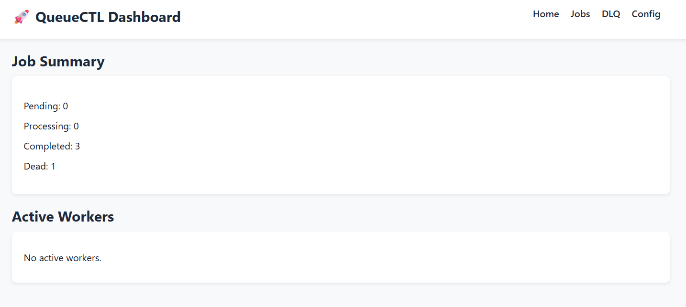
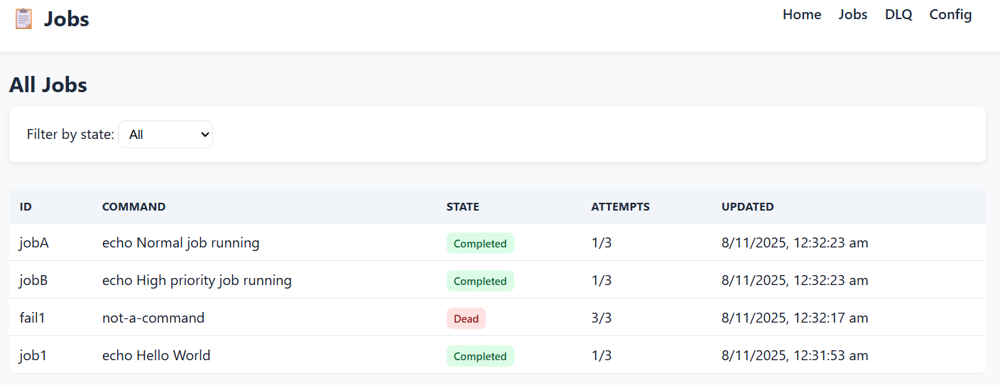
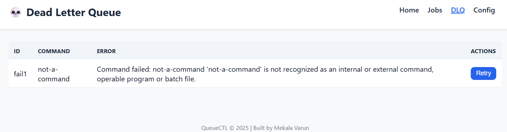

# QueueCTL - Background Job Queue System

QueueCTL is a CLI-based background job queue system with SQLite persistence and an optional web dashboard.
It manages background job execution with retries, exponential backoff, a Dead Letter Queue (DLQ), and configurable worker management.

## Features

### Core Features

- **CLI-based job queue system** — manage background jobs entirely via the command line.  
- **Persistent SQLite storage** — ensures job data, logs, and configuration persist across restarts.  
- **Multiple worker processes** — supports running multiple workers concurrently with job locking to prevent duplicate execution.  
- **Exponential retry backoff** — failed jobs are automatically retried using an exponential delay strategy.  
- **Dead Letter Queue (DLQ)** — permanently failed jobs are moved to a dedicated queue for later inspection or reprocessing.  
- **Job output logging** — captures standard output and error logs for every job execution.  
- **Configurable retry and timeout settings** — users can customize retry limits, backoff base, and job timeout durations.  
- **Graceful worker shutdown** — workers complete their current jobs before shutting down safely.  
- **Web dashboard for monitoring** — provides a simple web interface to view jobs, DLQ, workers, and configuration settings.  
- **Automated end-to-end test script** — validates complete system functionality including enqueue, execution, retry, and DLQ flow.  

### Bonus Features

- **Job priority queue** — higher-priority jobs are executed first.  
- **Real-time dashboard auto-refresh** — dashboard updates every few seconds to show the current system state.  
- **Retry requeue mechanism** — allows failed jobs in the DLQ to be easily retried from the dashboard or CLI.  
- **Graceful worker lifecycle management** — workers automatically exit when no jobs remain in the queue.  
- **Job logging and inspection tools** — CLI commands to view detailed job execution logs and errors.  
- **Persistent configuration system** — configuration stored in SQLite and adjustable via CLI or dashboard.  
- **Automated testing utility** — includes a shell script (`test.sh`) for verifying all core functionalities end-to-end.  


## Technologies Used

This project is built using a lightweight and reliable stack designed for performance, simplicity, and persistence.

- **Node.js (v18+)**  
  Used as the core runtime environment to build the CLI, worker system, and web dashboard.  
  Node’s event-driven model makes it ideal for handling concurrent background tasks efficiently.

- **SQLite (via `better-sqlite3`)**  
  Provides a fast, embedded, and persistent database to store jobs, logs, configurations, and worker states.  
  `better-sqlite3` offers synchronous and thread-safe operations, ensuring data integrity between multiple workers.

- **Commander.js** — *CLI Framework*  
  Handles command-line parsing and subcommands for `queuectl`.  
  Simplifies building intuitive CLI interfaces with argument validation and help messages.

- **Express + EJS** — *Web Dashboard*  
  Powers the optional web dashboard for real-time job monitoring.  
  Express serves as the backend server, while EJS templates render dynamic job and worker data for visualization.

- **UUID** — *Unique job and worker IDs*  
  Ensures each job and worker process is uniquely identifiable.  
  This prevents collisions when managing multiple workers and jobs concurrently across restarts.


## Architecture Overview

### Job Lifecycle

Each job in QueueCTL moves through the following states:

- **Pending** — Job is queued and waiting to be picked up by an available worker.  
- **Processing** — A worker has claimed the job and is executing the assigned command.  
- **Completed** — The command executed successfully (exit code `0`).  
- **Failed** — The job failed but is still eligible for retries.  
- **Dead** — The job has exceeded its maximum retries and is moved to the Dead Letter Queue (DLQ).

This ensures reliable execution with retry and recovery mechanisms for transient failures.

### Data Persistence

- All jobs, logs, worker metadata, and configuration are stored in a **SQLite** database located at:.queue/queue.sqlite
- The database uses **WAL (Write-Ahead Logging)** mode for better concurrency and crash safety.
- The following tables are used:
- `jobs`: stores job metadata and execution state.
- `job_logs`: stores stdout/stderr logs for each job.
- `workers`: tracks worker processes, PIDs, and heartbeats.
- `config`: maintains persistent system configuration.

This ensures data durability and safe concurrent access across multiple workers.

### Worker Logic

Each worker runs as an independent Node.js process and continuously polls the database for available jobs.

- **Job Claiming**  
  - The worker atomically selects a pending job and marks it as `processing`.  
  - Prevents multiple workers from executing the same job simultaneously.

- **Execution**  
  - The worker executes the job’s shell command using `child_process.exec()`.  
  - Captures both `stdout` and `stderr` logs and stores them in the `job_logs` table.

- **Retry & Backoff**  
  - If a job fails, it is automatically rescheduled with an exponential backoff delay.  
  - Formula:  
    ```
    delay = base ^ attempts
    ```  
  - The backoff base value is configurable (default: `2`).

- **Dead Letter Queue (DLQ) Handling**  
  - Once a job exceeds its configured `max_retries`, it is moved to the `dead` state.  
  - Dead jobs appear in the DLQ and can be manually retried from either the CLI or the web dashboard.

- **Graceful Shutdown**  
  - When a stop request is issued, workers complete their current job before exiting cleanly.  
  - Idle workers automatically exit when there are no pending jobs left in the queue.

---

## Assumptions & Trade-offs

### Assumptions
- The system runs on a single host (no distributed coordination needed).  
- Commands are shell-based and short-lived (e.g., `echo`, `sleep`, scripts).  
- SQLite provides sufficient durability and performance for small to medium workloads.  
- Job concurrency is limited by the number of active workers.

### Trade-offs and Simplifications
- **SQLite instead of Redis or PostgreSQL**  
Chosen for simplicity, persistence, and zero setup overhead. Perfect for local or small-scale use.
- **Single-node worker pool**  
Multi-process (not multi-machine) design avoids distributed locking complexity.
- **File-based logs** avoided  
Logs are stored in the database for simplicity rather than in separate files.
- **Exponential backoff only**  
Other retry strategies (e.g., linear, jitter) were not implemented to keep logic simple.
- **Limited scheduling support**  
Jobs can have a `run_at` timestamp but there is no full cron-like scheduling.
- **No external dependencies**  
The project intentionally avoids Redis, RabbitMQ, or Docker to stay lightweight and easy to run locally.


---

## 5. Testing Instructions

A complete automated test script is included:  
`test.sh` — validates the full end-to-end workflow.

### Run Tests
```bash
bash test.sh
```

## Usage Examples

Below are practical examples demonstrating how to use the **QueueCTL** CLI tool and verify its core functionality.

All examples are derived from the automated test script (`test.sh`) that performs a full end-to-end validation of the system.

---

### 1. Enqueue a Normal Job

```bash
queuectl enqueue --id job1 --command "echo Hello World"
```
Output:
```bash
Enqueued job: job1
```
### 2. Start Worker to Process Job
```bash
queuectl worker start --count 1 --foreground
```

```bash
🎯 Starting worker 1 in foreground...

Worker 72a7e42c-e59a-4bf4-bcc6-365b6f47dc68 started (PID 4936)
Worker picked job: job1 (priority 0)
Starting job: job1 | Command: "echo Hello World" | Priority: 0 | Attempt: 1/3
Job job1 completed in 0.02s
No more jobs left. Worker exiting.
Worker 72a7e42c-e59a-4bf4-bcc6-365b6f47dc68 stopped gracefully.
```
### 3. Check System Status

```bash
queuectl status
```
Output:
```bash
{
  "jobs": {
    "pending": 0,
    "processing": 0,
    "completed": 1,
    "failed": 0,
    "dead": 0
  },
  "active_workers": 0
}
```

### 4. Verify Completed Jobs

```bash
queuectl list --state completed
```
Output:
```bash
[
  {
    "id": "job1",
    "command": "echo Hello World",
    "state": "completed",
    "attempts": 1,
    "max_retries": 3,
    "priority": 0,
    "run_at": 1762536616,
    "created_at": 1762536616,
    "updated_at": 1762536616,
    "worker_id": "72a7e42c-e59a-4bf4-bcc6-365b6f47dc68",
    "last_error": null
  }
]
```

### 5. Enqueue a Failing Job

```bash
queuectl enqueue --id fail1 --command "not-a-command"
```
Output:
```bash
Enqueued job: fail1
```
### 6. Process Failing Job and Trigger Retries

```bash
queuectl worker start --count 1 --foreground
```
Output (showing retries and DLQ transfer):
```bash

Worker picked job: fail1 (priority 0)
Starting job: fail1 | Command: "not-a-command" | Priority: 0 | Attempt: 1/3
Job fail1 failed (attempt 1), retrying in 2 seconds.
Worker picked job: fail1 (priority 0)
Starting job: fail1 | Command: "not-a-command" | Priority: 0 | Attempt: 2/3
Job fail1 failed (attempt 2), retrying in 4 seconds.
Worker picked job: fail1 (priority 0)
Starting job: fail1 | Command: "not-a-command" | Priority: 0 | Attempt: 3/3
Job fail1 permanently failed after 3 attempts. Moved to Dead Letter Queue (DLQ).
```


### 7. View Jobs in Dead Letter Queue (DLQ)

```bash
queuectl dlq list
```
Output:
```bash
[
  {
    "id": "fail1",
    "command": "not-a-command",
    "state": "dead",
    "attempts": 3,
    "max_retries": 3,
    "priority": 0,
    "run_at": 1762536626,
    "created_at": 1762536620,
    "updated_at": 1762536626,
    "worker_id": null,
    "last_error": "Command failed: not-a-command\n'not-a-command' is not recognized as an internal or external command,\r\noperable program or batch file.\r\n"
  }
]
```
### 8. Retry a Dead Job from DLQ

```bash
queuectl dlq retry fail1
```
Output:
```bash
Job fail1 moved from DLQ to pending queue
Job requeued: fail1
```
### 9. Verify Retried Job is Pending Again

```bash
queuectl list --state pending
```
Output:
```bash
[
  {
    "id": "fail1",
    "command": "not-a-command",
    "state": "pending",
    "attempts": 0,
    "max_retries": 3,
    "priority": 0,
    "run_at": 1762536632,
    "created_at": 1762536620,
    "updated_at": 1762536632,
    "worker_id": null,
    "last_error": null
  }
]
```

### 10. Reprocess the Retried Job

```bash
queuectl worker start --count 1 --foreground
```
Output:
```bash
Worker picked job: fail1 (priority 0)
Starting job: fail1 | Command: "not-a-command" | Priority: 0 | Attempt: 1/3
Job fail1 failed (attempt 1), retrying in 2s.
...
Job fail1 permanently failed after 3 attempts. Moved to DLQ.
```
### 11. Verify DLQ and Completed Jobs

```bash
queuectl list --state completed
queuectl dlq list
```
Output:
```bash
{
  "completed": 1,
  "dead": 1
}
```
### 12. Enqueue Multiple Jobs with Priorities

```bash
queuectl enqueue --id jobA --command "echo Normal job running"
queuectl enqueue --id jobB --command "echo High priority job running" --priority 10
```
Output:
```bash
Enqueued job: jobA
Enqueued job: jobB
```
### 13. Verify Pending Jobs (JobB Should Appear First)

```bash
queuectl list --state pending
```
Output:
```bash
[
  {
    "id": "jobB",
    "command": "echo High priority job running",
    "priority": 10
  },
  {
    "id": "jobA",
    "command": "echo Normal job running",
    "priority": 0
  }
]
```
### Start Worker to Process Priority Jobs

```bash
queuectl worker start --count 1 --foreground
```
Output:
```bash
Worker picked job: jobB (priority 10)
Job jobB completed in 0.02s
Worker picked job: jobA (priority 0)
Job jobA completed in 0.01s
No more jobs left. Worker exiting.
```
### 15. Final System Status

```bash
queuectl status
```
Output:
```bash
{
  "jobs": {
    "pending": 0,
    "processing": 0,
    "completed": 3,
    "failed": 0,
    "dead": 1
  },
  "active_workers": 0
}
```
## Setup Instructions

Follow these steps to set up and run **QueueCTL** locally.

### 1. Clone the Repository
Clone the public repository from GitHub:
```bash
git clone https://github.com/ShadowwPhoenix/queuectl.git
cd queuectl
```
### 2. Install Dependencies
Install all required Node.js dependencies:
```bash
npm install
```
### 3. Run the Automated Test Script (Full Workflow)

You can verify the full functionality of QueueCTL using the automated end-to-end test script provided in the repository.
```bash
bash test.sh
```
This will automatically:

- Enqueue jobs  
- Run workers  
- Simulate failures and retries  
- Verify Dead Letter Queue (DLQ) functionality  
- Test job priorities
### 4. Run the Web Dashboard
Install all required Node.js dependencies:
```bash
npm run dashboard
```
Then open your browser at:
```bash
http://localhost:3000
```
You’ll see a live dashboard interface displaying job statistics, workers, and configuration.
###  Dashboard View

#### Home Page (Job Summary & Active Workers)



Shows an overview of all job states (Pending, Processing, Completed, Dead) and currently active workers.

#### Jobs Page



Displays all jobs in the system, with their current state, retry count, and timestamps. You can filter jobs by status (pending, completed, dead, etc.).

#### Dead Letter Queue (DLQ)



Lists permanently failed jobs. Each entry shows the failed command and error message, with a button to retry the job.

#### Configuration Page


Shows system configuration parameters such as max-retries, backoff-base, and timeout-ms. These values can be managed through the CLI.

## Contact

For questions, support, or feedback, please feel free to contact:

**Mekala Varun**  
📧 Email: [varunyadav4868@gmail.com](mailto:varunyadav4868@gmail.com)  
